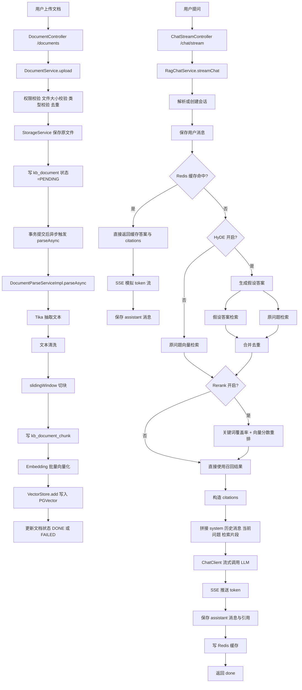
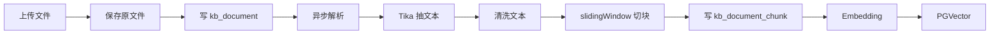
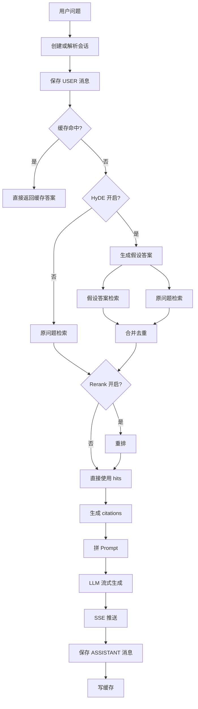

# RAG 流程详解

本文档基于当前项目的实际实现，梳理从文档上传、解析、切块、向量化，到检索、重排、生成、缓存、流式返回的完整 RAG 链路，并补充面试和项目讲解常用知识点。

---

## 1. 一句话概括

这套项目的核心流程是：

文档上传 -> 文本抽取 -> 切块 -> 向量化入库 -> 用户提问 -> 检索相关片段 -> 可选 HyDE / Rerank 增强 -> 拼接 Prompt -> LLM 生成答案 -> SSE 流式返回 -> 落库与缓存。

---

## 2. 整体流程图

### 2.1 端到端总流程



### 2.2 简化版流程

```text
入库链路：上传 -> 抽文本 -> 切块 -> 向量化 -> 入向量库
问答链路：提问 -> 检索 -> 重排 -> 组 Prompt -> 生成 -> 流式返回
```

---

## 3. 文档入库流程

### 3.1 上传与持久化

入口是后端文档上传接口，主要做以下事情：

1. 校验用户是否有当前知识库的写权限。
2. 校验文件是否为空、大小是否合法、类型是否允许。
3. 读取文件字节并计算 SHA-256，用于同一知识库内去重。
4. 把原始文件保存到对象存储或本地存储。
5. 写入 `kb_document` 表，初始状态为 `PENDING`。
6. 在事务提交后，异步触发解析任务，避免异步线程读不到未提交数据。

这一阶段的目标是先把原始文件和元数据稳定落库，再进入异步解析流水线。

### 3.2 文本抽取

解析任务里，项目使用 Apache Tika 做多格式文本抽取。它的职责是把 PDF、Word、Markdown、TXT、HTML 等格式统一转换成纯文本。

这样做的好处是：

- 抽取层统一，不需要每种格式手写解析器。
- 后续切块和向量化只面对纯文本，流程简单很多。

### 3.3 文本清洗

抽取出来的原始文本会先做一轮清洗，主要包括：

- 统一换行符。
- 去掉大部分控制字符。
- 压缩连续空行。
- 清理行尾空格。

这一步的目标不是改变文本语义，而是减少噪声，让后续切块更稳定。

### 3.4 切块

项目没有使用现成的 splitter，而是自己实现了 `slidingWindow` 字符滑窗切块。

当前配置：

- `chunk-size: 800`
- `chunk-overlap: 100`

切块策略有三个关键点：

1. 固定窗口长度切分。
2. 相邻 chunk 之间保留 overlap，避免边界信息只出现一次。
3. 在窗口末尾优先寻找软切点，比如换行、句号、问号、分号，减少硬截断。

这样做不能保证语义绝对完整，但能显著降低边界损失。

### 3.5 Chunk 落库

每个切出来的片段都会写入 `kb_document_chunk` 表，并记录：

- `docId`
- `kbId`
- `seq`
- `content`
- `charCount`
- `tokenCount`

这里的 `tokenCount` 是估算值，不是 tokenizer 精确结果。

### 3.6 向量化与向量入库

后端会把 chunk 批量包装成 Spring AI 的 `Document` 对象，并附带 metadata：

- `docId`
- `kbId`
- `chunkId`
- `seq`
- `docName`

然后调用向量模型生成 embedding，再通过 `VectorStore.add` 写入 PGVector。写入成功后，会把向量库使用的 `vectorId` 回写到 `kb_document_chunk`。

### 3.7 入库链路图



---

## 4. 问答链路流程

### 4.1 创建会话与保存用户消息

用户发起 `/chat/stream` 请求后，服务端先做两件事：

1. 如果没有会话，就新建会话。
2. 把当前用户问题先保存为一条 `USER` 消息。

这样做的好处是会话和消息先落库，即使后续大模型失败，也能保留用户输入和链路痕迹。

### 4.2 Redis 问答缓存

系统会根据 `kbId + normalizedQuestion` 生成缓存 key。如果命中缓存：

- 直接取出缓存中的 `answer` 和 `citations`。
- 按小块模拟 token 流式输出。
- 保存 assistant 消息。
- 结束本次请求。

缓存的作用是减少重复问题的 LLM 成本和响应延迟。

### 4.3 检索

如果缓存未命中，就进入检索阶段。

当前项目默认使用向量检索：

1. 校验用户对知识库是否有读权限。
2. 构造 `SearchRequest`。
3. 指定 `kbId` 过滤条件，只搜当前知识库。
4. 调用 `vectorStore.similaritySearch`。
5. 把返回结果转成 `hits` 列表。

每个 hit 通常包含：

- `content`
- `score`
- `kbId`
- `docId`
- `chunkId`
- `seq`
- `docName`

### 4.4 HyDE 增强检索

HyDE 的全称是 Hypothetical Document Embeddings。它不是直接拿用户问题检索，而是：

1. 先让 LLM 根据用户问题生成一段短的“假设答案”。
2. 用这段假设答案做一次向量检索。
3. 同时再用原始问题做一次向量检索。
4. 把两路结果合并去重，并保留更高分结果。

HyDE 解决的问题是：用户问题常常是疑问句、口语句，而知识库文档更像陈述句。把问题先转成“像文档的文本”，召回效果往往更好。

缺点是：

- 需要额外调用一次 LLM。
- 成本和延迟都会增加。
- 如果假设答案偏了，可能影响召回方向。

### 4.5 Rerank 重排

Rerank 的意思是“重排序”。它不是再召回新文档，而是对已经召回的一批候选片段重新排一次序。

当前项目的实现不是独立 reranker 模型，而是一个混合评分：

- 向量分数占 0.6
- 关键词覆盖率占 0.4

这样做的目的，是把既语义相关、又命中关键术语的内容排得更靠前。

Rerank 的价值在于：

- 初次召回更看重“可能相关”。
- 重排更看重“最适合回答”。

### 4.6 Prompt 组装

检索结果确定后，系统会组装最终 Prompt，主要由以下几部分组成：

1. System Prompt。
2. 截断后的历史对话。
3. 当前用户问题。
4. 检索出来的上下文片段。

其中每个上下文片段会附带来源文档名和 chunk 序号，这样方便回答后做引用溯源。

### 4.7 LLM 生成与 SSE 流式返回

后端通过 ChatClient 流式调用大模型，拿到 token 后立即通过 SSE 推给前端。前端边接收边渲染，所以用户看到的是逐字生成效果。

流式事件通常包括：

- `conversation`
- `user_message`
- `citations`
- `token`
- `assistant_message`
- `done`
- `error`

### 4.8 落库与缓存

生成完成后，系统还会做三件事：

1. 保存 assistant 消息。
2. 保存引用的 `chunkId` 列表。
3. 把答案和 citations 写入 Redis 缓存。

### 4.9 问答链路图



---

## 5. 项目中的关键知识点

### 5.1 什么是 Chunk

Chunk 就是把长文拆成适合检索和喂给模型的小片段。因为：

- 向量模型处理超长文本效果差。
- 检索希望定位更细粒度内容。
- Prompt 上下文长度有限，不可能把整篇文档都塞进去。

### 5.2 为什么要 Overlap

如果两个 chunk 完全不重叠，边界上的定义、条件、示例、结论很容易被拆开。Overlap 的作用是让边界附近内容在相邻 chunk 中重复出现，从而减少边界信息损失。

### 5.3 向量检索和关键词检索的区别

向量检索更关注语义相似度，适合自然语言问答；关键词检索更关注字面匹配，适合类名、配置项、报错码、术语这种精确查询。

一句话概括：

- 向量检索：看意思像不像。
- 关键词检索：看词有没有命中。

### 5.4 为什么需要 Rerank

初次召回只负责“尽量把相关内容捞回来”，但排序不一定最准。Rerank 负责把最该给大模型看的内容排到前面，从而提高最终答案质量。

### 5.5 HyDE 和 Query Rewrite 的区别

它们都发生在检索前，但作用不同：

- Query Rewrite：把原问题改写成更适合检索的问题。
- HyDE：直接生成一段“像答案的文本”再检索。

### 5.6 TopK 是什么

TopK 指一次检索最多返回多少条候选片段。TopK 太小可能召回不足，太大则会引入噪声，增加后续重排和 Prompt 污染风险。

### 5.7 Similarity Threshold 是什么

Similarity Threshold 是相似度阈值。只有高于阈值的候选片段才会被保留。阈值过高会漏召回，过低会带来噪声。

### 5.8 Citation 是什么

Citation 就是引用信息。项目会把每条回答对应的 chunk、文档、序号、片段摘要保存下来，用于前端展示“答案来源”，减少幻觉感。

### 5.9 缓存为什么重要

RAG 系统里，检索成本通常还能接受，但大模型生成成本比较高。对相同问题做缓存，可以显著降低：

- 平均响应时间
- 模型调用成本
- 高并发下的后端压力

### 5.10 为什么要异步解析文档

文档抽取、切块、向量化都属于耗时操作。如果上传接口同步执行，会让用户等待很久，也更容易超时。异步解析可以提升上传体验，同时便于状态跟踪和失败重试。

---

## 6. 当前项目实现的特点

### 6.1 已实现能力

- 文档上传、去重、解析、切块、向量化入库。
- 向量检索。
- HyDE 可选增强检索。
- 关键词混合重排。
- Redis 问答缓存。
- SSE 流式输出。
- 引用溯源。

### 6.2 当前实现的工程取舍

1. 切块使用字符滑窗，不是 token 级 splitter。

优点：实现简单、可控、无 tokenizer 依赖。  
缺点：字符数和真实 token 数不完全一致。

2. Rerank 采用轻量混合评分，不是独立 reranker 模型。

优点：不需要额外模型部署。  
缺点：效果上限不如专业 reranker。

3. HyDE 是全局开关，不是前端请求级参数。

优点：部署简单。  
缺点：前端无法按单次会话灵活切换。

### 6.3 可继续优化的方向

1. 切块升级为 token 级或结构化切块。
2. 检索加入 BM25 或混合检索。
3. Rerank 替换成专用 reranker 模型。
4. 召回后补邻块，降低边界语义损失。
5. 增加 Query Rewrite。
6. 将 HyDE 和 Rerank 做成请求级开关。

---

## 7. 关键实现位置

下面这些类基本覆盖了当前项目的 RAG 主链路：

- 文档上传与异步解析触发：`ai-knowledge-base-backend/src/main/java/com/smartdocs/aikb/module/kb/service/impl/DocumentServiceImpl.java`
- 文档解析、清洗、切块、向量入库：`ai-knowledge-base-backend/src/main/java/com/smartdocs/aikb/module/kb/service/impl/DocumentParseServiceImpl.java`
- 向量检索：`ai-knowledge-base-backend/src/main/java/com/smartdocs/aikb/module/kb/service/impl/DocumentRetrievalServiceImpl.java`
- HyDE：`ai-knowledge-base-backend/src/main/java/com/smartdocs/aikb/module/kb/service/impl/HydeRetrievalServiceImpl.java`
- Rerank：`ai-knowledge-base-backend/src/main/java/com/smartdocs/aikb/module/kb/service/impl/KeywordRerankServiceImpl.java`
- RAG 主流程：`ai-knowledge-base-backend/src/main/java/com/smartdocs/aikb/module/chat/service/impl/RagChatServiceImpl.java`
- SSE 接口：`ai-knowledge-base-backend/src/main/java/com/smartdocs/aikb/module/chat/controller/ChatStreamController.java`
- 配置项：`ai-knowledge-base-backend/src/main/resources/application.yml`

---

## 8. 面试表达模板

可以用下面这段话快速概括：

> 这个项目的 RAG 流程分两段。第一段是离线入库：用户上传文档后，后端先做权限校验、文件去重和原文件存储，再异步用 Tika 抽取文本，经过清洗和自定义 slidingWindow 切块后，把 chunk 向量化写入 PGVector。第二段是在线问答：用户提问后，系统先做会话和消息落库，再优先查 Redis 缓存；未命中时走向量检索，可选 HyDE 增强召回，再用关键词混合 Rerank 做二次排序，之后把检索片段、历史消息和系统提示一起组装成 Prompt，调用大模型流式生成答案，通过 SSE 返回前端，同时保存引用和缓存结果。

---

## 9. 最后总结

RAG 的核心不是“把文档喂给模型”，而是把长文档转成可检索、可引用、可裁剪的知识片段，在用户提问时动态取回最相关的上下文，再让模型基于上下文回答。

从工程角度看，RAG 的关键不止是模型调用，而是整条链路的稳定性和质量控制：

- 入库质量决定可检索性。
- 检索质量决定上下文质量。
- 上下文质量决定最终答案质量。
- 缓存、引用、流式输出决定产品体验。
